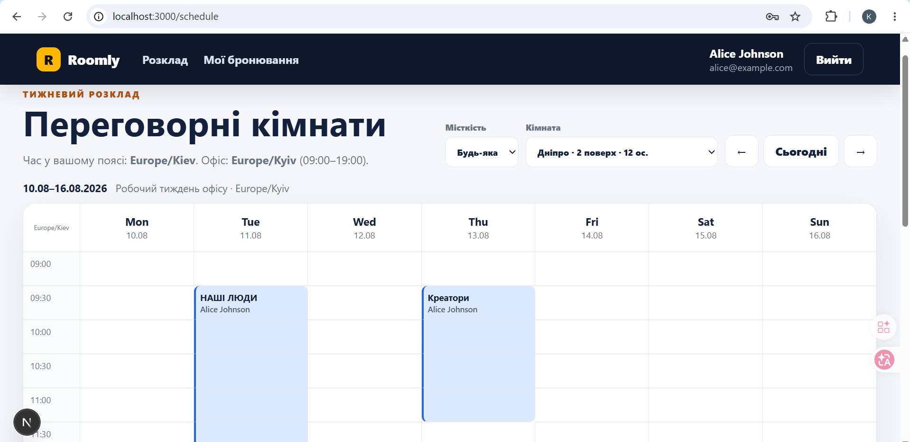
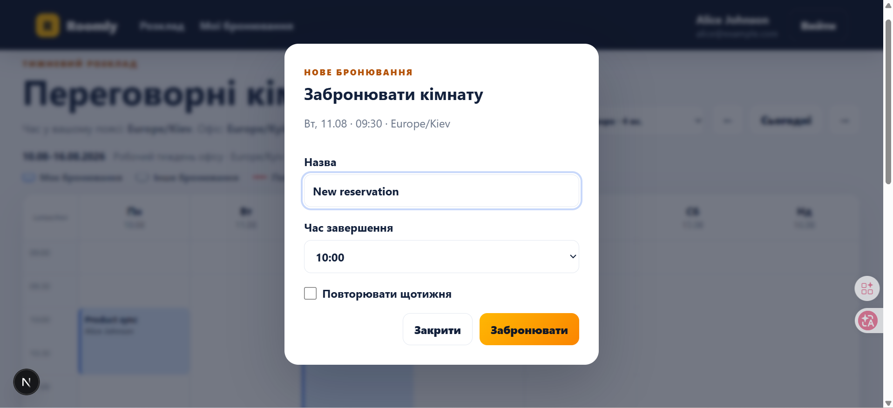
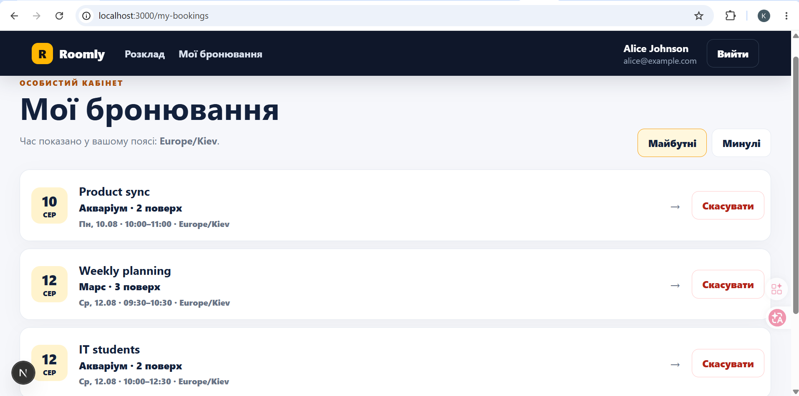

# Roomly — Meeting Room Booking

[](https://github.com/KyryloKovalcyber/ua-skills-meeting-room-booking/actions/workflows/ci.yml)

Конкурсний проєкт **UA Skills 2026 / Meeting Room Booking** — full-stack вебзастосунок для перегляду тижневого розкладу переговорних кімнат, створення бронювань, щотижневих серій, безпечного скасування та in-app сповіщень.

## Screenshots

### Weekly schedule



### Create booking



### My bookings



---

## Реалізовано

### Основні вимоги

- реєстрація: ім’я, email, пароль;
- email нормалізується на сервері через `trim().toLowerCase()`;
- пароль 8–72 символи й зберігається тільки як bcrypt-хеш;
- серверні сесії в HttpOnly cookie переживають перезавантаження сторінки;
- 6 переговорних кімнат із seed-даними;
- тижнева сітка створена вручну на CSS Grid — без FullCalendar;
- 30-хвилинні слоти та навігація вперед/назад по тижнях;
- назва бронювання та ім’я автора видимі в розкладі;
- власні бронювання візуально відрізняються від чужих;
- виділення поточного дня та поточного часового слота;
- UI показує час у timezone браузера;
- сервер перевіряє робочі години в `Europe/Kyiv` — 09:00–19:00;
- час у БД зберігається як UTC `DateTime`;
- серверна валідація: майбутній час, 30-хвилинні межі, тривалість 30–240 хв, робочі години, конфлікти;
- сусідні бронювання дозволені: `10:00–11:00` і `11:00–12:00` не конфліктують;
- скасування лише власних бронювань і через UI, і прямим API-запитом;
- «Мої бронювання»: майбутні/минулі, сортування, пагінація минулих, перехід у потрібну кімнату/тиждень;
- loading / empty / error / success states;
- field-level form errors і блокування submit під час запиту;
- confirmation dialog перед скасуванням;
- `.env.example` і конфігурація через env;
- unit та DB-backed route integration tests;
- GitHub Actions CI.

### Бонусні можливості

- **Docker Compose**;
- **email verification у dev-режимі**: одноразовий token, у БД лише SHA-256 hash, TTL, verification-link друкується у server log;
- **бронювання заборонене сервером до підтвердження email**;
- **щотижневі recurring bookings** — 2–12 зустрічей у серії;
- **атомарне створення серії**: якщо один occurrence конфліктує, не створюється жоден;
- **скасування одного occurrence або всієї майбутньої серії**;
- **DB-level race protection** через `UNIQUE(roomId, startAt)` у `BookingSlot`;
- **concurrency integration test**: два одночасні запити на один слот → лише один переможець;
- **end-of-booking notifications** за `NOTIFY_BEFORE_MINUTES`, якщо наступний слот тієї самої кімнати вже зайнятий;
- **exactly-once notification record** через DB unique constraint;
- **фільтр кімнат за місткістю**;
- **mobile scenario**: один день на вузькому екрані з перемикачем днів.

---

## Стек

- Next.js 16 / React 19 / TypeScript
- Prisma ORM 6
- SQLite
- Luxon
- Zod
- bcryptjs
- Vitest
- GitHub Actions
- Docker Compose

SQLite обрано свідомо: перевіряльнику не потрібен окремий сервер БД. Файли БД не комітяться.

---

## Швидкий запуск на чистій машині

### Вимоги

- Node.js 24 LTS
- npm

### 1. Встановити залежності

```bash
npm ci
```

### 2. Підготувати env, Prisma Client, БД, міграції та seed

```bash
npm run setup:all
```

`setup:all`:

1. створює `.env` з `.env.example`, тільки якщо `.env` ще немає;
2. виконує `prisma generate`;
3. застосовує всі migrations;
4. запускає idempotent seed.

### 3. Повна перевірка

```bash
npm run check
```

Команда запускає:

1. unit + integration tests;
2. `tsc --noEmit`;
3. production `next build`.

### 4. Запустити застосунок

```bash
npm run dev
```

Відкрити:

```text
http://localhost:3000
```

---

## Тестові користувачі

```text
alice@example.com / Password123
bob@example.com   / Password123
```

Обидва demo users уже email-verified.

---

## Email verification у dev

Після реєстрації новий користувач автоматично входить у систему, але **не може створювати бронювання**, доки не підтвердить email.

У terminal/server log з’явиться рядок приблизно такого вигляду:

```text
[email-verification] user@example.com: http://localhost:3000/api/auth/verify?token=...
```

Відкрийте це посилання у браузері. Token одноразовий та має TTL:

```text
EMAIL_VERIFICATION_TTL_MINUTES=30
```

У БД зберігається тільки SHA-256 hash verification token.

---

## Recurring bookings

У booking dialog можна ввімкнути **«Повторювати щотижня»** та вибрати 2–12 зустрічей.

Серія створюється атомарно:

- сервер валідовує кожен occurrence;
- перевіряє конфлікти для всієї серії;
- створює всі occurrences в одній transaction;
- якщо один occurrence конфліктує, transaction rollback не залишає частково створеної серії.

Повтори будуються у timezone офісу, тому локальний час зустрічі зберігається навіть під час переходу DST.

У «Мої бронювання» для серії можна скасувати:

- лише вибрану зустріч;
- усі активні майбутні occurrences серії.

---

## Захист від гонки

Логічна overlap-перевірка потрібна для зрозумілої відповіді користувачу, але фінальний захист забезпечує БД.

Кожне активне бронювання створює `BookingSlot` для кожного 30-хвилинного відрізка. Таблиця має:

```text
UNIQUE(roomId, startAt)
```

Тому два конкурентні запити не можуть обидва успішно зайняти один і той самий слот.

---

## Перетини інтервалів

Використовуються напіввідкриті інтервали `[start, end)`:

```text
existingStart < newEnd && existingEnd > newStart
```

Отже:

- `10:00–11:00` + `11:00–12:00` — дозволено;
- `10:00–11:00` + `10:30–11:30` — конфлікт.

---

## UTC і часові пояси

Робочі слоти формуються відносно `Europe/Kyiv`, конвертуються у UTC для transport/storage та відображаються у IANA timezone браузера.

Сервер перед перевіркою робочих годин конвертує UTC назад у timezone офісу.

Recurring occurrences додаються календарними тижнями саме в office timezone, що зберігає wall-clock meeting time під час DST transitions.

---

## End-of-booking notifications

Frontend опитує `/api/notifications` раз на 30 секунд. Сервер перевіряє активні бронювання користувача, які завершуються в межах:

```text
NOTIFY_BEFORE_MINUTES=10
```

Notification створюється лише якщо наступне **активне** бронювання тієї самої кімнати починається точно в момент завершення поточного.

Exactly-once persistence забезпечує unique constraint:

```text
(userId, currentBookingId, type)
```

Якщо поточне або наступне бронювання скасоване до генерації notification, сповіщення не створюється. Cancellation також прибирає ще неактуальні notification records, пов’язані зі скасованими bookings.

---

## Окрема тестова БД

Integration tests не використовують `prisma/dev.db`.

Vitest примусово використовує:

```text
file:./test.db
```

`tests/global-setup.ts` перед suite видаляє стару test DB та застосовує migrations. Це робить DB-backed tests відтворюваними й не забруднює локальні demo-дані.

---

## CI

`.github/workflows/ci.yml` запускається на push до `main` і на pull request.

Pipeline:

```text
npm ci
npm run setup:all
npm run check
```

Тобто CI перевіряє той самий clean-machine workflow, який описаний у README.

---

## Docker Compose

```bash
docker compose up --build
```

Після запуску:

```text
http://localhost:3000
```

SQLite зберігається у Docker volume `meeting-data`.

---

## Основні API endpoints

```text
POST   /api/auth/register
POST   /api/auth/login
POST   /api/auth/logout
GET    /api/auth/session
POST   /api/auth/verification/request
GET    /api/auth/verify?token=...

GET    /api/rooms?minCapacity=8
GET    /api/rooms/:roomId/bookings?from=...&to=...

POST   /api/bookings
DELETE /api/bookings/:bookingId?scope=single|series

GET    /api/me/bookings?type=upcoming
GET    /api/me/bookings?type=past&page=1

GET    /api/notifications
PATCH  /api/notifications/:notificationId
```

Server-side validation є джерелом істини. Frontend validation використовується для UX.

---

## Структура

```text
src/
  app/                       Next.js pages + API Route Handlers
  components/                UI
  lib/                       auth, env, Prisma, verification
  modules/bookings/          booking rules + schemas
  modules/notifications/     notification generation
prisma/
  migrations/                versioned database migrations
  schema.prisma
  seed.ts
tests/
  global-setup.ts            isolated SQLite test DB
  intervals.test.ts          unit tests
  api-bookings.integration.test.ts
  email-verification.integration.test.ts
  notifications.integration.test.ts
scripts/
  setup.mjs                  one-command setup
.github/workflows/
  ci.yml                     CI quality gate
```

---

## Ключові рішення

- **Server validation is authoritative.**
- **Session token**: у БД тільки SHA-256 hash; raw token лише в HttpOnly cookie.
- **Verification token**: у БД тільки SHA-256 hash; одноразовий + TTL.
- **Soft cancellation**: booking history зберігається через `cancelledAt`; slot claims звільняються.
- **Race protection**: DB unique constraint, а не лише `findFirst`.
- **Recurring atomicity**: одна transaction для всієї серії.
- **Exactly-once notification**: DB unique constraint.
- **No calendar library**: calendar grid побудований вручну на CSS Grid.
